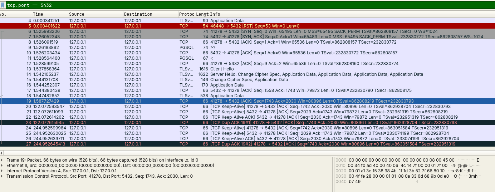

# PostgreSQL Security Hardening

## Introduction

PostgreSQL is one of the most widely used relational database systems. While its default configuration is suitable for development and initial setup, it should not be considered secure enough for production environments.

This document highlights several common security weaknesses and demonstrates how to harden a PostgreSQL server before deploying it.

---

# 1. Encrypt Client Connections (SSL/TLS)

## Why?

Without SSL/TLS, database traffic travels across the network unencrypted. An attacker on the same network may capture credentials or sensitive data using packet analysis tools.

## Check

```sql
SHOW ssl;
```

Expected output:

```
on
```

## Enable SSL

Generate a private key and certificate:

```bash
openssl genrsa -out server.key 2048

openssl req -new -x509 -key server.key -out server.crt -days 365
```

Then configure:


```conf
ssl = on
ssl_cert_file = 'server.crt'
ssl_key_file = 'server.key'
```


Restart PostgreSQL and verify again.




---

# 2. Configure Client Authentication

The `pg_hba.conf` file controls who can connect and how they authenticate.

### Insecure

```conf
local all all trust
```

Anyone with local access can connect without a password.

### Better

```conf
local all all scram-sha-256
```

or

```conf
local all all peer
```

depending on your environment.

Avoid using `trust` outside isolated development systems.

---

# 3. Restrict Network Access

By default, PostgreSQL can be configured to listen on all interfaces.

Avoid:

```conf
listen_addresses='*'
```

If remote access is unnecessary:

```conf
listen_addresses='localhost'
```

Additionally, restrict port **5432** using a firewall.

---

# 4. Avoid Using the postgres Account

The default `postgres` role has unrestricted privileges.

Applications should never connect using this account.

Create a dedicated user:

```sql
CREATE USER app_user
WITH PASSWORD 'StrongPassword';
```

Grant only the required permissions:

```sql
GRANT SELECT, INSERT, UPDATE
ON TABLE customers
TO app_user;
```

---

# 5. Apply the Principle of Least Privilege

Every account should have only the permissions required for its task.

Examples:

| User | Permissions |
|------|-------------|
| Reporting | SELECT |
| Data Entry | INSERT, UPDATE |
| Administrator | SUPERUSER |

Avoid granting `SUPERUSER` unless absolutely necessary.

---

# 6. Protect the Public Schema

Many installations leave the `public` schema writable.

Revoke unnecessary permissions:

```sql
REVOKE CREATE
ON SCHEMA public
FROM PUBLIC;
```

This prevents ordinary users from creating arbitrary database objects.

---

# 7. Enable Logging

Logging helps detect unauthorized access and investigate incidents.

Useful settings:

```conf
log_connections = on
log_disconnections = on
log_statement = ddl
```

The **pgAudit** extension extends PostgreSQL's logging capabilities by recording database operations such as:

- SELECT
- INSERT
- UPDATE
- DELETE
- CREATE
- ALTER
- DROP

This makes it easier to investigate suspicious activities and detect unauthorized access.

---

## Install pgAudit


```
sudo pacman -S postgresql-pgaudit
```

```
sudo apt install postgresql-15-pgaudit
```

Enable the extension in PostgreSQL:


```conf
shared_preload_libraries = 'pgaudit'
```

Restart PostgreSQL.

Then create the extension:

```sql
CREATE EXTENSION pgaudit;
```

---

## Enable Auditing

Example configuration:

```conf
pgaudit.log = 'read, write, ddl'
```

This logs:

- Read operations (SELECT)
- Write operations (INSERT, UPDATE, DELETE)
- Schema modifications (CREATE, ALTER, DROP)

---

## Verify

Execute a query:

```sql
SELECT * FROM customers;
```

Then review the PostgreSQL log files. You should find entries generated by pgAudit describing the executed statement.

---

## Benefits

- Detect suspicious database activity.
- Support forensic investigations.
- Meet compliance requirements.
- Improve visibility into database access.


---

# 8. Keep PostgreSQL Updated

Security vulnerabilities are regularly discovered and fixed.

Always use a supported PostgreSQL release and apply security updates promptly.

---

# Conclusion

A secure PostgreSQL deployment is not achieved by installation alone. Enabling encrypted connections, restricting authentication methods, minimizing privileges, protecting the network, and maintaining updated software significantly reduce the attack surface and improve the overall security of the database server.
