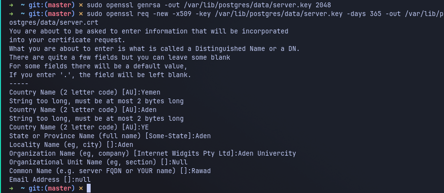
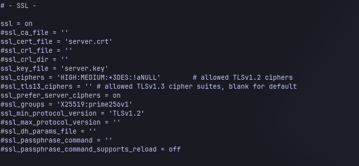

# PostgreSQL Security

## Introduction

PostgreSQL is one of the most popular open-source Relational Database Management Systems (RDBMS). It is widely used by organizations, universities, financial institutions, and technology companies to store and manage large volumes of structured data. Due to its reliability, scalability, and rich feature set, PostgreSQL has become a preferred choice for many critical applications.

Because databases often contain highly sensitive information such as customer records, financial transactions, employee information, and business data, they are considered one of the most valuable assets within an organization. As a result, they are also one of the primary targets for cyberattacks.

Although PostgreSQL provides many built-in security features, its default configuration is mainly designed to simplify installation and initial deployment rather than maximize security. If these default settings remain unchanged, attackers may exploit them to gain unauthorized access or intercept sensitive information.

For this reason, database administrators should review the default configuration and apply security hardening techniques before deploying PostgreSQL in a production environment.

---

# Security Weaknesses in the Default Configuration

Several default settings require attention because they may expose the database to unnecessary security risks. Two of the most important issues are discussed below.

---

# 1. Communication Encryption

## Description

One of the most important aspects of database security is protecting the communication between the PostgreSQL server and its clients.

When encryption is not enabled, all communication—including SQL queries, database responses, usernames, and other sensitive information—may travel across the network in plain text.

An attacker who has access to the same network can monitor this traffic using packet analysis tools such as **Wireshark**. This allows the attacker to observe sensitive information or even perform a Man-in-the-Middle (MITM) attack by intercepting and modifying the communication.

Although PostgreSQL supports SSL/TLS encryption, it must be configured manually. Without enabling SSL, sensitive information remains exposed while being transmitted over the network.

---

## Why is this a security risk?

Without encryption, attackers may be able to:

- Capture SQL queries.
- Read confidential database responses.
- Monitor authentication attempts.
- Perform Man-in-the-Middle (MITM) attacks.
- Compromise sensitive organizational data.

---

## Recommended Solution

The recommended solution is to enable SSL/TLS encryption.

The implementation process includes:

1. Generate a private key.
2. Generate an SSL certificate.
3. Copy both files into PostgreSQL's data directory.
4. Enable SSL in `postgresql.conf`.
5. Restart PostgreSQL.
6. Verify that SSL is enabled.

---

## Step 1 – Generate the Private Key

Use OpenSSL to generate a private key.

```bash
openssl genrsa -out server.key 2048
```

## Step 2 – Generate the SSL Certificate

Generate a self-signed SSL certificate.

```bash
openssl req -new -x509 -days 365 -key server.key -out server.crt
```

OpenSSL will ask for basic certificate information such as:

- Country
- State
- Organization
- Common Name

These values can be customized according to your environment.

### Screenshot 



---


## Step 4 – Enable SSL

Open the configuration file:

```
postgresql.conf
```

Modify the following settings:

```conf
ssl = on

ssl_cert_file = 'server.crt'

ssl_key_file = 'server.key'
```

Restart the PostgreSQL service after saving the configuration.

### Screenshot 2



---

## Step 5 – Verify SSL

Connect to PostgreSQL and execute:

```sql
SHOW ssl;
```

Expected output:

```
 ssl
-----
 on
```

### Screenshot 3


---

## Summary

Enabling SSL/TLS protects all communication between the PostgreSQL server and its clients. Even if network traffic is intercepted, the transmitted information remains encrypted and cannot be read without the appropriate decryption keys. Therefore, SSL should always be enabled in production environments to protect sensitive organizational data.

---

# 2. Powerful Authorized Users

## Description

PostgreSQL creates a default administrative account named **postgres** during installation. This account has **SUPERUSER** privileges, meaning it has unrestricted access to every database object and administrative function.

Although this account is necessary for managing the database system, using it for daily application connections creates a significant security risk. If an attacker gains access to this account, they effectively gain complete control over the database server.

They could:

- Read all stored information.
- Modify or delete important data.
- Create new privileged accounts.
- Change security settings.
- Drop databases.
- Execute administrative commands.

For this reason, the **postgres** account should be reserved only for database administration.

---

## Why is this a security risk?

Using an account with excessive privileges violates the Principle of Least Privilege.

If application credentials are compromised, attackers immediately receive full administrative access instead of only the permissions required by the application.

---

## Recommended Solution

Instead of connecting as **postgres**, create separate users for each application.

Grant only the permissions that are required.

Example:

```sql
CREATE USER app_user
WITH PASSWORD 'StrongPassword';
```

Grant only the necessary permissions:

```sql
GRANT SELECT, INSERT, UPDATE
ON TABLE customers
TO app_user;
```

Avoid granting:

```sql
SUPERUSER
```

unless the account is used for database administration.

---

## Principle of Least Privilege

The Principle of Least Privilege (PoLP) states that every user should receive only the permissions necessary to perform their assigned tasks.

For example:

- Report users only require **SELECT**.
- Data-entry users require **INSERT** and **UPDATE**.
- Database administrators require **SUPERUSER** privileges.

Applying this principle significantly limits the impact of compromised accounts.

---

## Verify User Privileges

Run:

```sql
\du
```

This command displays all PostgreSQL roles and their assigned privileges.

### Screenshot 6

Capture the output showing that the **postgres** account has **Superuser** privileges.

---

## Create a Limited User

Create a dedicated application account.

```sql
CREATE USER app_user
WITH PASSWORD 'StrongPassword';
```

Run:

```sql
\du
```

again.

### Screenshot 7

Capture the output showing that **app_user** does **not** have Superuser privileges.

---

# Conclusion

PostgreSQL offers a strong security foundation, but relying on its default configuration may expose the database to unnecessary risks. Enabling SSL/TLS encryption protects data while it is transmitted across the network, while applying the Principle of Least Privilege reduces the damage that could result from compromised accounts. By configuring secure communication, limiting administrative privileges, and creating dedicated users for applications, organizations can significantly improve the confidentiality, integrity, and availability of their databases.
