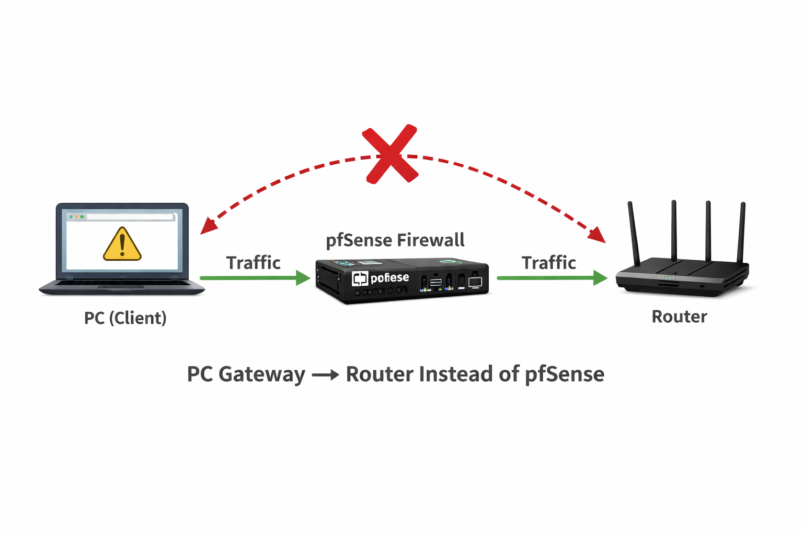
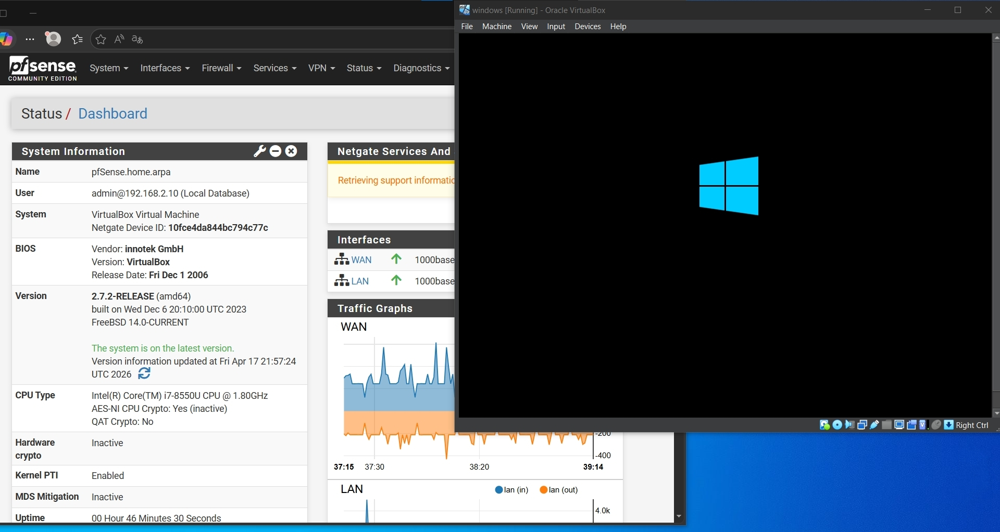

# pfSense Firewall

   pfSense Is Firewall in Layer 3 (Network Layer)

**Before we begin any steps!**

we must know that pfSense requires at least two network cards.

- The first card is a WAN card that receives internet or connections from outside the network. 

- The second card is a LAN card for internal devices.

- All of this is so that it acts as an intermediary between connections and traffic in order to control them.


# Dependencies


<p align="center">
  
  
  
</p>


## Setup Firewall

**VirtualBox Network Settings**

We will go to the Network Adapters option. You will see a bar at the top with labels such as: Card 1, Card 2

<b>First card:</b> We will make it an external WAN network for the internet.

```Because we are using a virtual environment, we will make it a Bridge Adapter.```

<b>Second Card:</b> We will connect it to the local area network (LAN) as agreed; all of this is to make pfSense the intermediary.


```Again, because we are in a virtual environment, we will choose Internal Network This card will connect to our Windows computer so that we can control the packets entering and leaving it.```





---

## 🚀 Initial System Configuration

Once the VM boots from the ISO, we need to map the physical (virtual) adapters to the logical interfaces inside pfSense.

### 1. Assign Interfaces
From the console menu, we assign the adapters:
* **WAN Interface:** Select the adapter linked to the `Bridged` mode (usually `em0` or `vtnet0`).
* **LAN Interface:** Select the adapter linked to the `Internal Network` (usually `em1` or `vtnet1`).

### 2. Configure LAN IP
To manage the firewall, we must set a static IP for the internal network:
1. Select Option **2** (Set interface(s) IP address).
2. Assign a static IP such as `192.168.10.1`.
3. Enable the **DHCP Server** on the LAN to automatically provide IP addresses to our internal clients (Windows VM).

> [!TIP]
> Make sure the LAN IP is on a different subnet than your home router (e.g., if your home is 192.168.1.x, use 192.168.10.x for the lab).
>


### DHCP & DNS Infrastructure Setup

This is where the magic happens. We are now configuring the "brain" of our network to ensure the Windows client is completely under our control.


**Step-1:** Activating the DHCP Server (The Pulse)
Inside the pfSense WebGUI, navigate to 

`Services > DHCP Server > LAN`

- Action: Check Enable DHCP server on LAN     interface.

- Range Configuration:

  I defined the pool from 192.168.10.10 to     192.168.10.100.

- The Gateway:

  Ensure the Gateway field points to the      pfSense LAN IP (192.168.10.1).
  Why? This forces any device that joins      our "Internal Network" to receive its       identity and "route out" only through our   firewall.


**Step 2:** DNS Hijacking for Security (The Map)


`Go to Services > DNS Resolver > General` 

- Action:

  Enable DNS Query Forwarding.


  The Logic: By setting pfSense as the        Primary DNS for the client, we ensure       that every website request (e.g.,           google.com) must pass through our           resolver first. This is the foundation      for future Web Filtering and Ad-blocking.





<br>

# Real-World Troubleshooting (What I Solved)
Applying this in a virtual environment isn't always smooth. Here is how I handled the common "Dead Ends":
