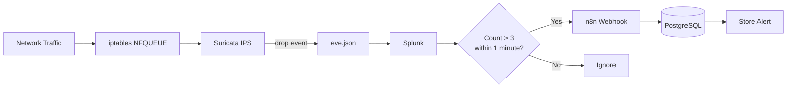
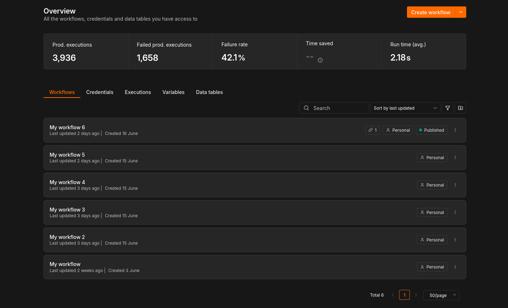
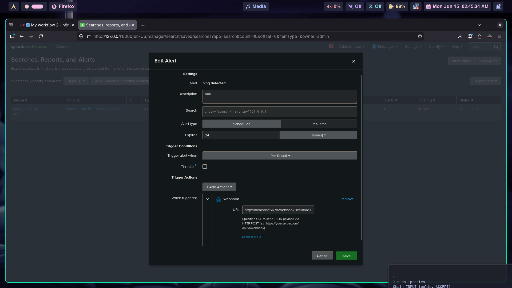

# Automated SecOps Pipeline: Intrusion Detection to Automated Mitigation

## Project Overview

This project demonstrates an end-to-end automated security operations (SecOps) pipeline designed to bridge network defense with data persistence and incident response. The pipeline automates critical security phases: detection and containment via Suricata (IDS/IPS), log analysis and alerting through Splunk Enterprise, and asynchronous execution, data filtering, and relational storage driven by n8n and PostgreSQL.


---


## Core System Dependencies

The environment relies on the following core components to process and handle network traffic:

* **Suricata:** Deployed as an Intrusion Detection and Prevention System (IDS/IPS) to inspect packet payloads.
* **NFQUEUE (Netfilter Queue):** Used to bind Linux iptables rules directly to Suricata for inline traffic processing on the same host.
* **Splunk Enterprise:** Configured as a central SIEM platform for log ingestion, behavior analysis, and automated webhook alerting.
* **n8n:** Utilized as the SOAR orchestration engine to parse alerts and manage downstream actions.
* **PostgreSQL:** Serves as the relational database backend for persisting threat intelligence indicators.


## Architecture




## Phase 1: Traffic Redirection & Intrusion Prevention (Suricata)

To enable inline inspection on the host machine, network traffic is intercepted at the kernel level via `iptables` and routed to a specific Netfilter Queue (`NFQUEUE`). Suricata listens to this queue to detect and optionally drop malicious traffic.

Execute the following commands to configure the packet redirection rules:

```bash
# Redirect inbound, outbound, and forwarded traffic to NFQUEUE 0
sudo iptables -A INPUT -j NFQUEUE --queue-num 0 --queue-bypass
sudo iptables -A OUTPUT -j NFQUEUE --queue-num 0 --queue-bypass
sudo iptables -A FORWARD -j NFQUEUE --queue-num 0 --queue-bypass

```

Once the firewall rules are applied, initiate the Suricata engine to process the queue in inline mode:

``` sudo suricata -q 0 ```


## Phase 2: N8N Automation Setup

n8n is a tool that helps you connect your favorite apps and automate everyday tasks so you don't have to do them manually. Think of it like Lego blocks for software: you just drag and drop different "nodes" (like Gmail, Slack, or a database) onto a screen and link them together to pass information automatically.

**to install and start** 

```
    sudo npm install -g n8n --unsafe-perm && n8n start
    
```




## Phase 3: Log Aggregation & Real-Time Alerting (Splunk Enterprise)

Once Suricata processes the network traffic and generates security logs

```/usr/local/var/logs/suricata/eve.json```


Add it in Splunk Enterprise ingests these logs to analyze malicious behavior and trigger immediate alerts.

1. **Real-Time Search:** A custom search query is configured to continuously monitor the inbound traffic logs in real-time, ensuring zero latency between detection and notification.
2. **Instant Webhook Trigger:** The alert type is set explicitly to **Real-Time** (triggered per-result). The moment an anomalous log matches the criteria, Splunk fires an asynchronous Webhook payload containing the attacker metadata to the n8n orchestration engine.

### Real-Time Search Query (SPL)
```splunk

index="summary"
 | stats count as ip_count by src_ip
 | eval ip_risk=if(ip_count>5, "High", "Low")"

```

Save As Alert and fill the Form but using webhook in the end and set url example:

```http://localhost:5678/webhook/fc488ee4...```





## Phase 4: Automation & Data Persistence

Upon receiving the webhook payload, the n8n workflow extracts the attacker's metadata (e.g., `src_ip`, `timestamp`) and manages the incident lifecycle through the following automated actions:

* **Data Serialization & Persistence:** The extracted threat indicators are parsed and committed to a centralized PostgreSQL database for historical tracking.

  
* **Database Optimization (Data Deduplication):**

To eliminate logging redundancy and prevent database bloat during continuous scanning or brute-force events, the `ip_address` column in the schema is strictly constrained with a **`UNIQUE`** key. This ensures that only unique attackers are recorded, while updating the hit counter or timestamp dynamically.


* **Incident Response Extensibility:** Beyond data persistence, the orchestration engine is architected to scale for active mitigation, allowing it to:
  * Broadcast real-time security alerts via SMTP (Gmail) or Slack webhooks.
  * Execute remote security policies (e.g., automating a secondary firewall block via SSH or custom mitigation scripts).
